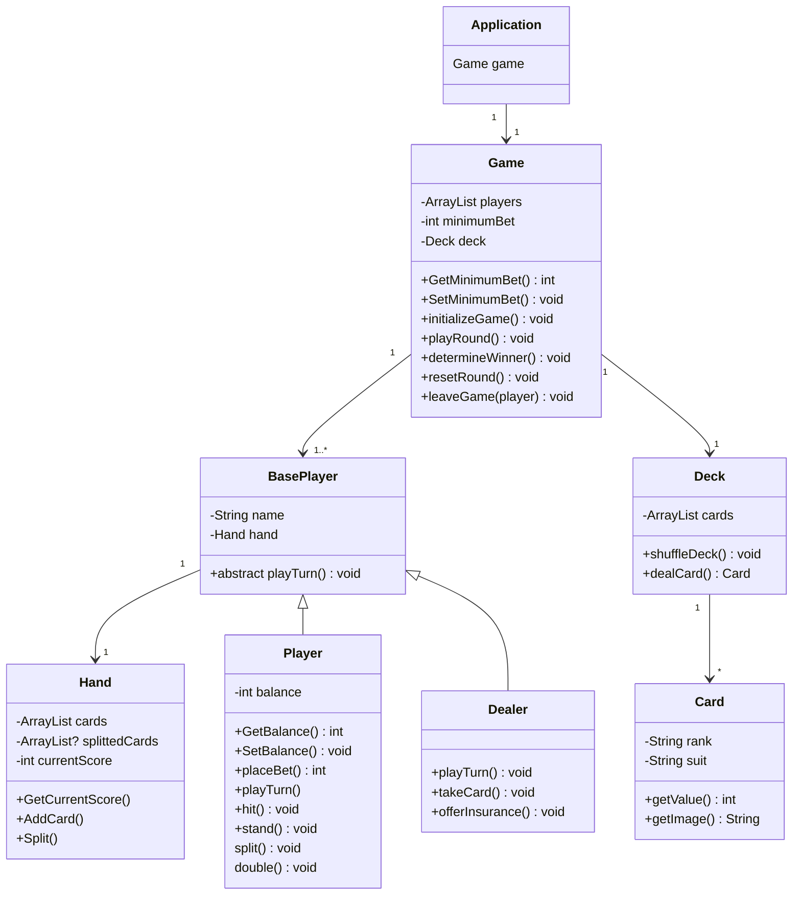

Class definition for KRAcH programming project

```mermaid
classDiagram
	class Card
	Card : -String rank
	Card : -String suit
	Card : +getValue() int
	Card : +getImage() String

	class Deck
	Deck : -ArrayList<Card> cards
	Deck : +shuffleDeck() void
	Deck : +dealCard() Card

	Deck "1" --> "*" Card

	class Hand
	Hand : -ArrayList<Cards> cards
	Hand : -ArrayList<Cards>? splittedCards
	Hand : -int currentScore
	Hand : +GetCurrentScore()
	Hand : +AddCard()
	Hand : +Split()	
	
	class BasePlayer
	BasePlayer : -String name
	BasePlayer : -Hand hand
	BasePlayer : +abstract playTurn () void

	BasePlayer "1" --> "1" Hand

	class Player
	Player : -int balance
	Player : +GetBalance() int
	Player : +SetBalance() void
	Player : +placeBet() int
	Player : +playTurn()
	Player : +hit() void
	Player : +stand() void
	Player : split() void
	Player : double() void
	
	class Dealer
	Dealer : +playTurn() void
	Dealer : +takeCard() void
	Dealer : +offerInsurance() void

	BasePlayer <|-- Player
	BasePlayer <|-- Dealer

	class Game
	Game : -ArrayList<Player> players
	Game : -int minimumBet
	Game : -Deck deck
	Game : +GetMinimumBet() int
	Game : +SetMinimumBet() void
	Game : +initializeGame() void
	Game : +playRound() void
	Game : +determineWinner() void
	Game : +resetRound() void
	Game : +leaveGame(player) void	

	Game "1" --> "1..*" BasePlayer
	Game "1" --> "1" Deck

	class Application
	Application : Game game

	Application "1" --> "1" Game
	
```
