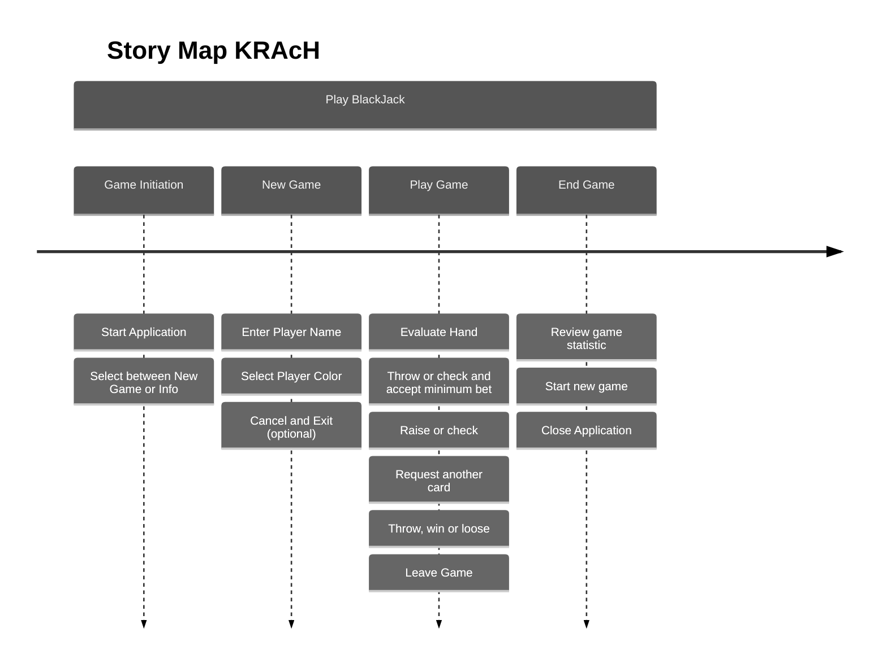

### Personas
##### Player
- The person that is actively interacting with the game.
- The average age of the player is approximately between 18 and 40.
- The player has a general interest for gaming.